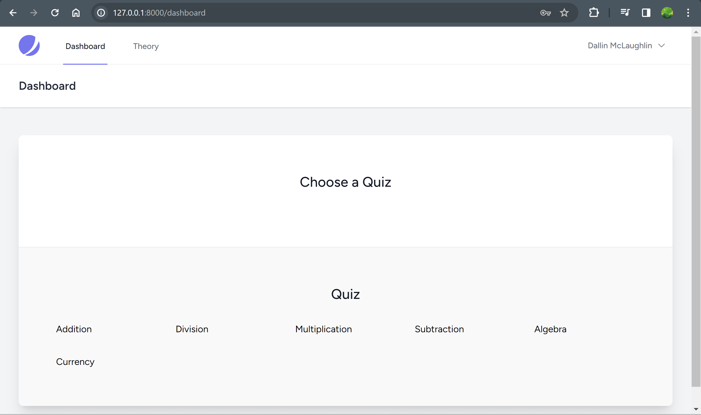
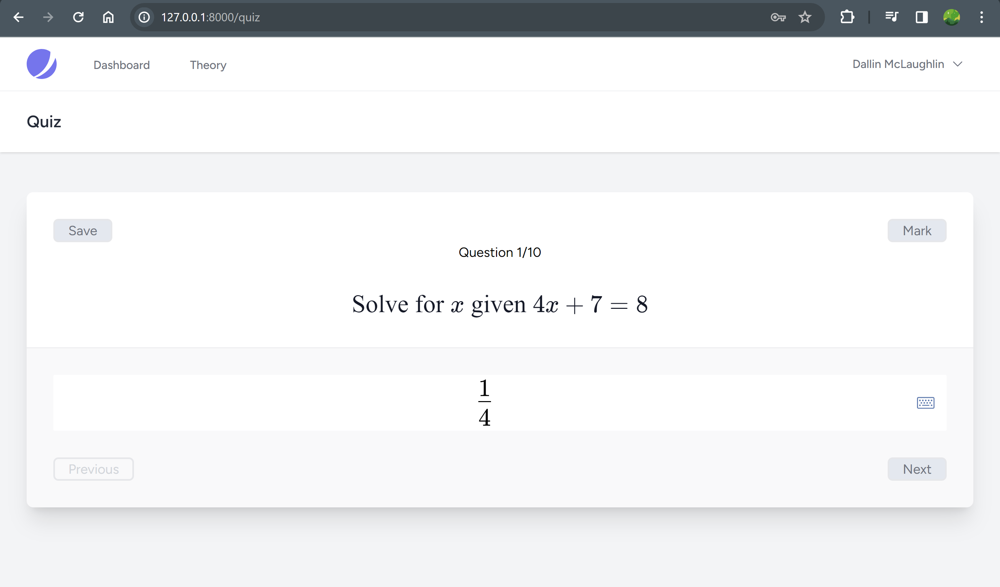
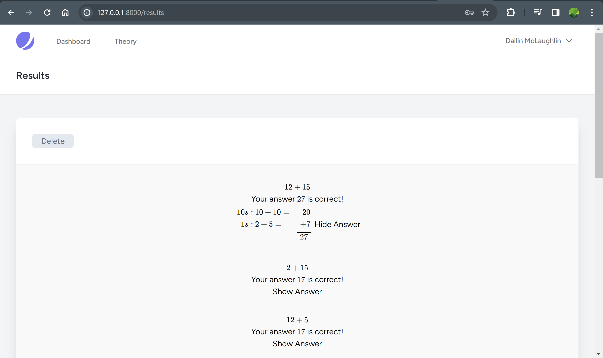
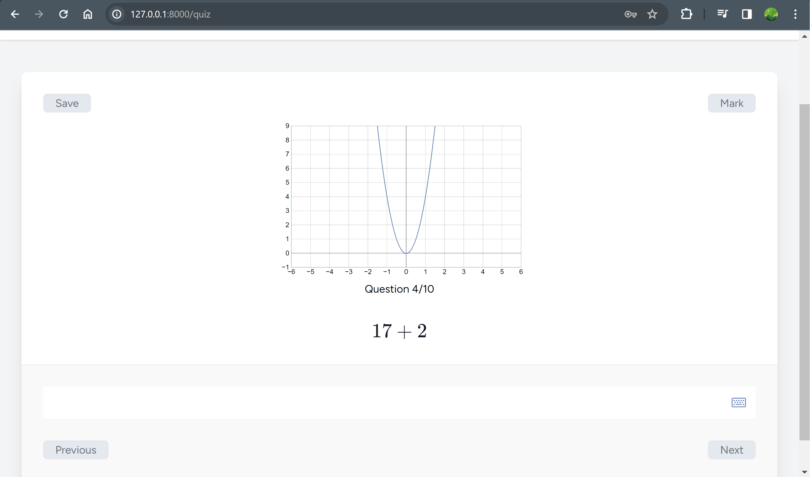
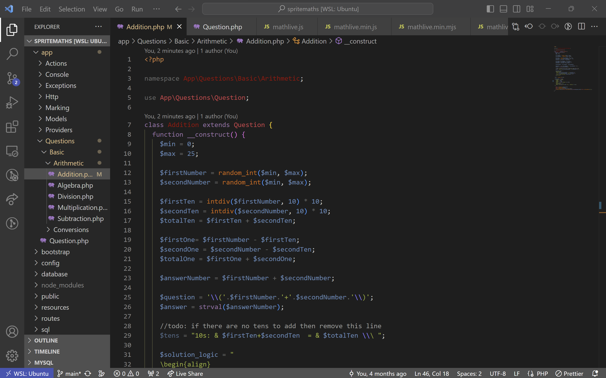
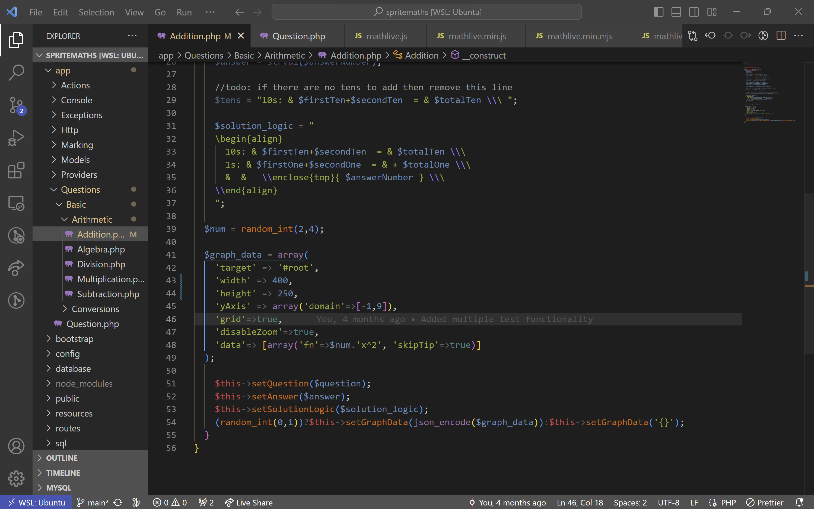
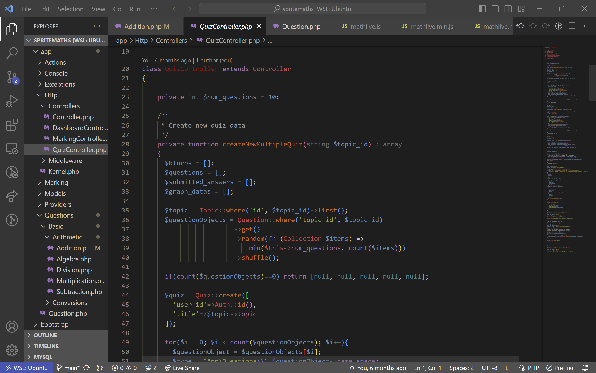

# About spritemaths Laravel and Vue version

This is a second version of [spritemaths](https://spritemaths.com). If you wish to try it in the browser: username: nillad12@gmail.com, password: dallin. It includes php, vue and mysql.
I really liked how easy vue was to make the UI impressive and interactive. It worked well with Mathlive even since Mathlive's recent updates. Although I did have to rewrite the code in some parts to make sure Mathlive was still compatible.

## Code used from outside libraries

-   [Mathlive](https://cortexjs.io/) for math input fields and math display candy.
-   [php math parser](https://github.com/mossadal/math-parser).
-   [function plotter](http://mauriciopoppe.github.io/function-plot/) for javascript and typescript

## Different View of spritemaths

This is the Home screen. The user will decide whether they wish to add another carton item to the database or start setting up the container for planning.

This is the Input screen. Here a user will input the carton types and how many of each type will need to be loaded into the container.

This is the View screen. You can view the container from any angle. Each stack of cartons can be selected so that the stack can be modified or deleted.

This is the View screen. Each carton in a currently selected stack can be selected so that the carton can change its orientation or deleted.

This is the View screen. Each carton in a currently selected stack can be selected so that the carton can change its orientation or deleted.

This is the View screen. Each carton in a currently selected stack can be selected so that the carton can change its orientation or deleted.

This is the View screen. Each carton in a currently selected stack can be selected so that the carton can change its orientation or deleted.
